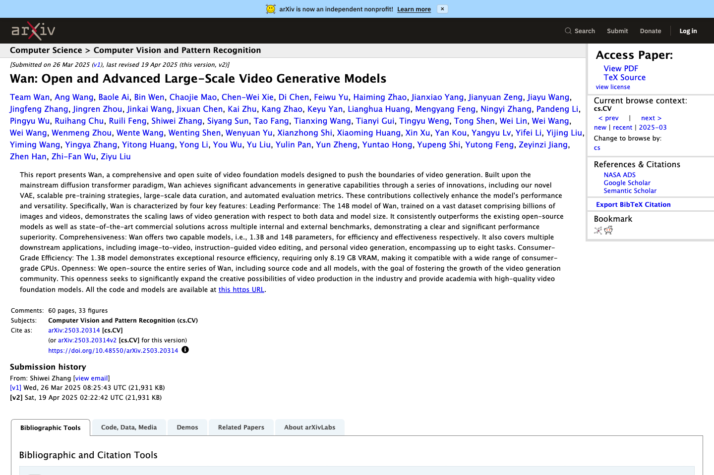

# Wan2-1-Unofficial

<div align="center">

**Unofficial PyTorch Reproduction of**  
# Wan: Open and Advanced Large-Scale Video Generative Models

[Video Generation / arXiv 2025]  
   

[Paper](https://arxiv.org/abs/2503.20314) · [PDF](https://arxiv.org/pdf/2503.20314) · [Issues](https://github.com/StaryMoon/Wan2-1-Unofficial/issues) · [Release](https://github.com/StaryMoon/Wan2-1-Unofficial/releases)

</div>

> This is an **unofficial** implementation maintained by [@StaryMoon](https://github.com/StaryMoon). If this repository helps your reading, reproduction, or course project, please consider giving it a star and following my GitHub profile.

## Paper / Project Preview

<p align="center">
  
</p>

<sub>Image source: public paper/project page screenshot, [Paper](https://arxiv.org/abs/2503.20314). Captured/organized on 2026-07-02. This repository is unofficial and is not affiliated with the paper authors.</sub>

## At a Glance

| Item | Details |
|---|---|
| Paper | Wan: Open and Advanced Large-Scale Video Generative Models |
| Venue / Source | Video Generation / arXiv 2025 |
| Focus | This repository organizes a PyTorch implementation for Wan: Open and Advanced Large-Scale Video Generative Models, focusing on open large-scale video generation with diffusion t... |
| Repository type | Unofficial PyTorch reproduction starter |
| Local entry point | `python scripts/smoke_test.py` |


## News

- **2026-06-11**: Initial public release with official-style project structure, citation metadata, configuration, PyTorch interfaces, and smoke test.

## Overview

This repository organizes a PyTorch implementation for **Wan: Open and Advanced Large-Scale Video Generative Models**, focusing on open large-scale video generation with diffusion transformers, VAE design, and scalable pretraining. The codebase is structured like a standard research repository so that model components, configuration files, scripts, and evaluation utilities can be extended independently.

Main goals:

- provide a clean PyTorch module layout for the paper;
- keep training, inference, evaluation, and configuration entry points explicit;
- track paper-reported metrics separately from local experiment logs;
- make it easy for contributors to inspect, compare, and extend the implementation.

## Repository Structure

```text
Wan2-1-Unofficial/
├── configs/
│   └── default.yaml
├── scripts/
│   └── smoke_test.py
├── src/wan2_1_unofficial/
│   ├── __init__.py
│   └── model.py
├── CITATION.cff
├── README.md
├── requirements.txt
└── pyproject.toml
```

## Installation

```bash
git clone https://github.com/StaryMoon/Wan2-1-Unofficial.git
cd Wan2-1-Unofficial
python -m venv .venv
source .venv/bin/activate
pip install -r requirements.txt
```

For CUDA-enabled experiments, install the PyTorch build matching your CUDA version from the official PyTorch website before installing the rest of the dependencies.

## Quick Check

```bash
python scripts/smoke_test.py
```

Expected output:

```text
sequence: (...)
embedding: (...)
loss: ...
```

## Data Preparation

```bash
mkdir -p data/train data/val data/test checkpoints outputs
```

Recommended layout:

```text
data/
├── train/
├── val/
└── test/
```

Keep private datasets, downloaded checkpoints, and generated outputs out of git. Dataset-specific converters can be added under `scripts/` while preserving the public repository structure.

## Training

Minimal module usage:

```python
import torch
from wan2_1_unofficial import ModelConfig, UnofficialModel, reconstruction_loss

config = ModelConfig(task="video", hidden_dim=128, num_layers=2, num_heads=4)
model = UnofficialModel(config)
optimizer = torch.optim.AdamW(model.parameters(), lr=1e-4)

token_ids = torch.randint(0, config.vocab_size, (2, 16))
out = model(token_ids=token_ids)
loss = reconstruction_loss(out["embedding"])
loss.backward()
optimizer.step()
```

## Inference

```python
import torch
from wan2_1_unofficial import UnofficialModel

model = UnofficialModel().eval()
with torch.no_grad():
    token_ids = torch.randint(0, model.config.vocab_size, (1, 16))
    y = model(token_ids=token_ids)["embedding"]
print(y.shape)
```

## Evaluation

Suggested entry points:

```bash
python scripts/smoke_test.py
# python scripts/evaluate.py --config configs/default.yaml --ckpt checkpoints/model.pt
```

Paper-reported values and local run values should be kept in separate columns so readers can distinguish citation numbers from local experiment logs.

## Paper Results

For copyright and license clarity, this repository links to the original paper figures and tables instead of redistributing screenshots copied from the PDF. The table below tracks where readers can find the paper-reported results.

| Result Type | Paper Location | Source |
|---|---|---|
| Main quantitative comparison | Main paper tables | [arXiv paper](https://arxiv.org/abs/2503.20314) |
| Ablation study | Experiment / ablation sections | [arXiv paper](https://arxiv.org/abs/2503.20314) |
| Qualitative examples | Main paper figures and appendix | [arXiv PDF](https://arxiv.org/pdf/2503.20314) |

## Reproduction Log

| Date | Config | Split | Metric | Value | Notes |
|---|---|---|---:|---:|---|
| 2026-06-11 | `configs/default.yaml` | smoke check | forward pass | ok | package interface validation |

## Implementation Status

- [x] Package layout and install metadata
- [x] Core PyTorch module interfaces
- [x] Default config and smoke test
- [x] Paper citation and result-location index
- [ ] Dataset-specific preprocessing scripts
- [ ] Paper-specific training recipe
- [ ] Evaluation and visualization scripts
- [ ] Public checkpoints and model zoo entries

## Model Zoo

| Model | Checkpoint | Config | Notes |
|---|---|---|---|
| default | TBA | `configs/default.yaml` | compact implementation interface |

## Citation

If you find this repository useful, please cite the original paper:

```bibtex
@article{Wan21_2025,
  title   = {Wan: Open and Advanced Large-Scale Video Generative Models},
  author  = {Wan Team},
  journal = {arXiv preprint arXiv:2503.20314},
  year    = {2025}
}
```

## Acknowledgements

- Thanks to the authors of **Wan: Open and Advanced Large-Scale Video Generative Models** for the original research.
- Thanks to arXiv for open access to the paper metadata and manuscript.
- This repository is inspired by standard open-source PyTorch research codebases.
- The implementation is unofficial and all paper names, datasets, and trademarks belong to their respective owners.

## License

This repository is released under the MIT License. The original paper, datasets, official code, project assets, and third-party dependencies remain governed by their own licenses.

## Keywords

pytorch, unofficial-implementation, reproduction, video-generation, diffusion-transformer, text-to-video, wan2.1
